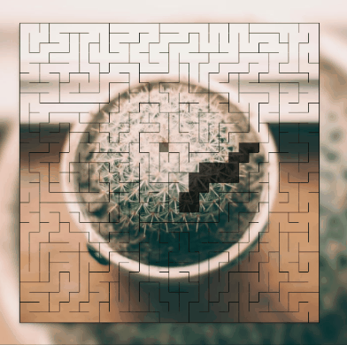

# Maze Generator

A fun **maze generator** that will uncover a **random picture**.

**Watch** the maze taking shape [here](https://vikvikvr.github.io/maze-generator/)! 👈

Built with vanilla web technologies.

Uses [this algorithm](https://en.wikipedia.org/wiki/Maze_generation_algorithm).
